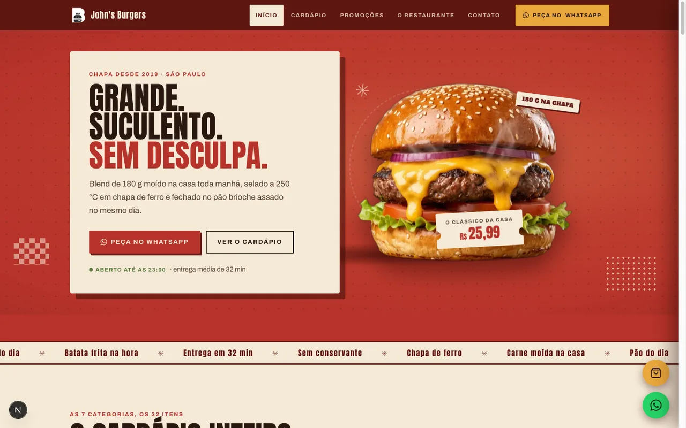
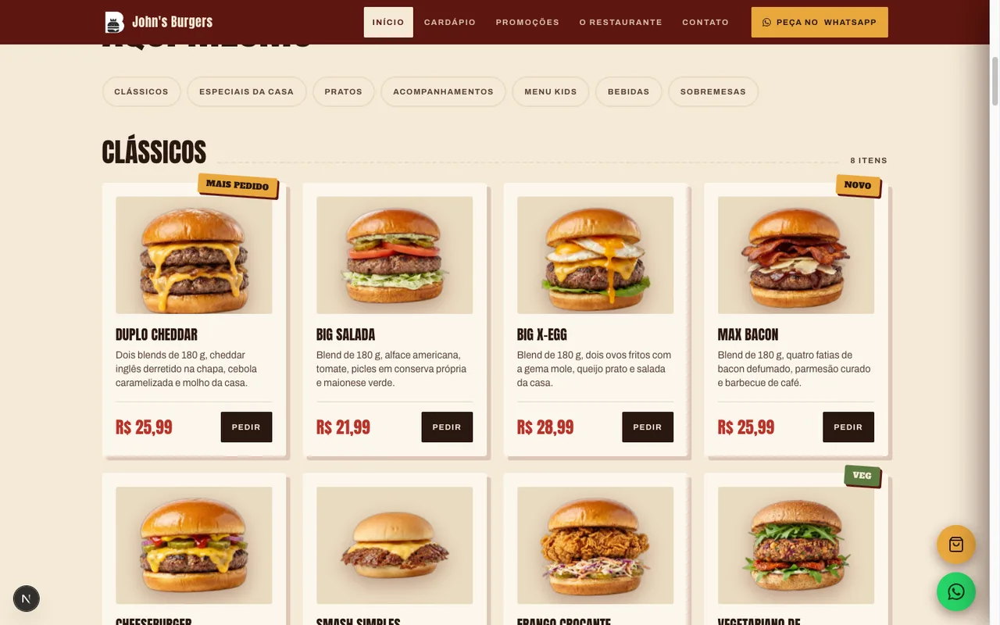
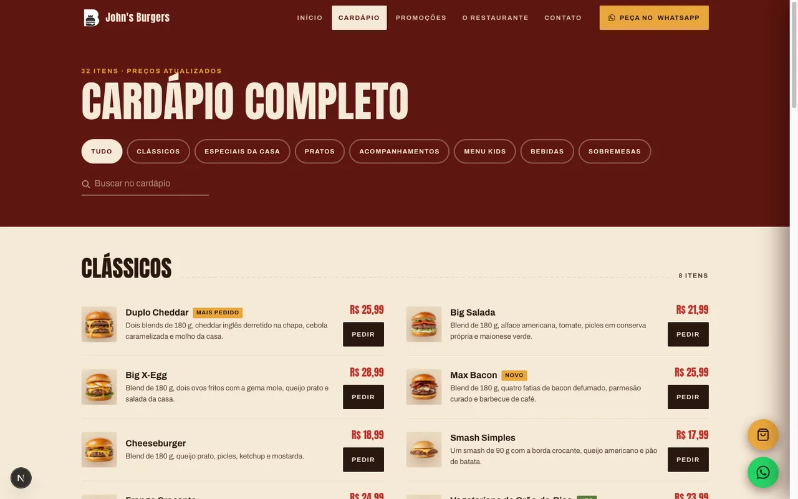
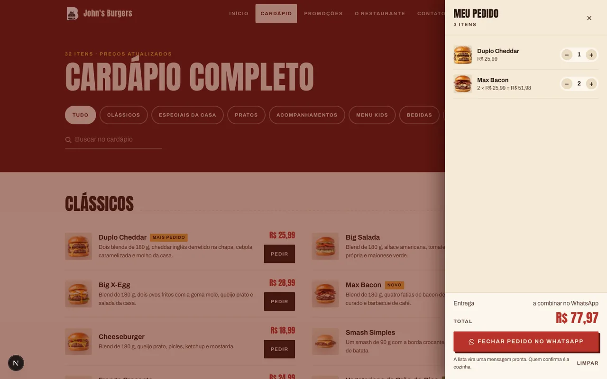
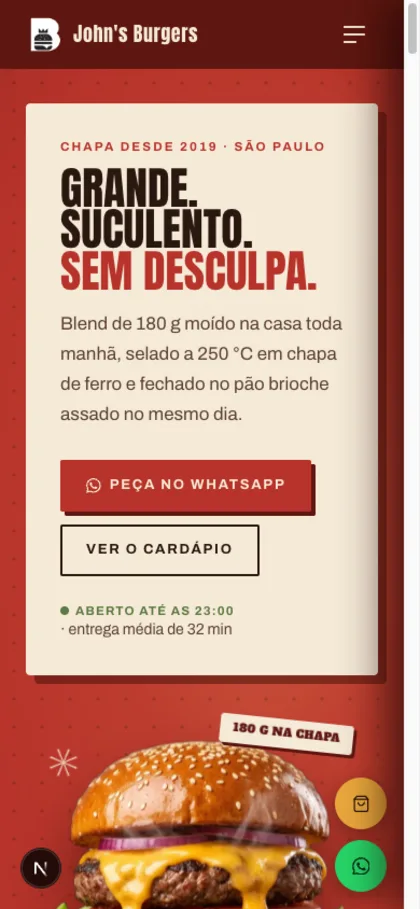
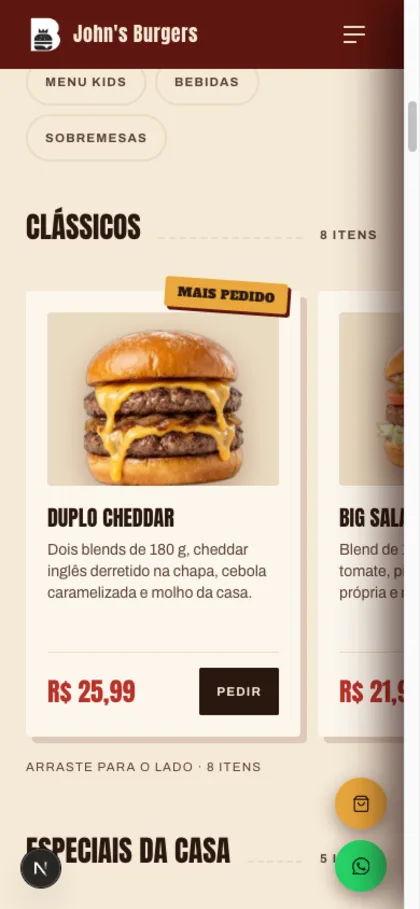
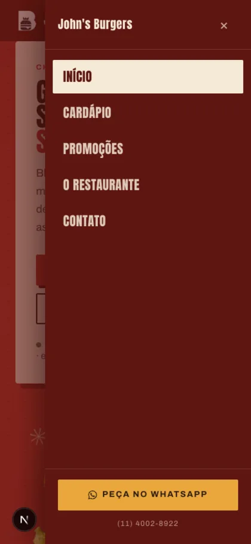

<div align="center">

# John's Burgers

**Landing de conversão + cardápio completo para hamburgueria.**
Redesign integral e migração de HTML + Bootstrap + Vite para Next.js.


</div>



## O que é

Site de hamburgueria pensado para **fazer o cliente pedir**: o cardápio inteiro
na primeira tela, pedido montado sem cadastro e a conversa terminando no
WhatsApp. Serve como modelo para qualquer casa do ramo — cores, textos, fotos e
preços saem todos de dois lugares (ver [Retematizar](#retematizar-para-outra-hamburgueria)).

A versão original era uma página estática em Bootstrap. Desta ficou só o
conteúdo; layout, identidade visual, arquitetura e fotos são novos.

## Como está feito

| Camada     | Escolha                                             |
| ---------- | --------------------------------------------------- |
| Framework  | Next.js 16 (App Router, React 19, Server Components) |
| Linguagem  | TypeScript, modo estrito                             |
| Estilo     | Tailwind CSS 4 com tokens próprios em `@theme`       |
| Tipografia | Anton · Archivo · Alfa Slab One                      |
| Imagens    | `next/image`, WebP, recorte com fundo transparente   |
| Deploy     | Vercel                                               |

Sem biblioteca de componentes, de animação ou de estado: o que existe é
`react` e `next`.

## Telas

### Catálogo na home — 32 itens, 7 categorias



Cada item é um card com foto, descrição e preço. Hambúrgueres aparecem
recortados sobre o creme; pratos, porções e bebidas vêm com mesa e balcão no
quadro. O card sabe qual dos dois usar por um campo do próprio item.

### Cardápio como ferramenta



A rota `/cardapio` cumpre outro papel: busca, filtro por categoria e lista
compacta, para quem já sabe o que quer.

### Pedido sem cadastro



O "Pedir" soma no painel lateral. No fim, a lista vira uma mensagem pronta no
WhatsApp — sem checkout, sem login, sem banco de dados. Quem confirma é a
cozinha.

### No celular

<div align="center">
  
  
  
</div>

Menu recolhido, categorias em carrossel com encaixe (em vez de 32 cards em
coluna) e alvos de toque de 44&nbsp;px. Auditado com Playwright: sem vazamento
horizontal, sem texto abaixo de 11&nbsp;px.

## Rodando

```bash
npm install
npm run dev      # http://localhost:3000
```

Outros scripts: `npm run build`, `npm run lint`, `npm run typecheck`.

Copie `.env.example` para `.env.local` e ajuste `NEXT_PUBLIC_SITE_URL` — ela
alimenta canonical, Open Graph, sitemap e robots.

## Estrutura

```
src/
  app/                 rotas (/ e /cardapio), layout, SEO e estilos globais
  components/
    ui/                primitivos: layout, botão, campo, tag, preço, ornamentos
    layout/            cabeçalho, rodapé e menu do celular
    home/              seções da página inicial
    menu/              card, linha, foto e navegador do cardápio
    order/             estado do pedido, painel e botões flutuantes
    marketing/         vitrine do desenvolvedor
  data/                casa, cardápio, promoções, navegação, galeria, SEO
  hooks/               camada modal, montagem, horário de funcionamento
  lib/                 tipos, formatadores, classes e dados estruturados
  assets/images/       imagens importadas estaticamente
```

Fronteiras: `app/` só compõe, `data/` não tem JSX, e `"use client"` fica
restrito ao que realmente tem estado — pedido, busca, navegação e o sinal de
aberto/fechado.

## Retematizar para outra hamburgueria

1. **Cores, sombras e medidas** — bloco `@theme` em `src/app/globals.css`.
   Trocar `--color-marca`, `--color-superficie` e `--color-destaque` muda a casa
   inteira; nenhum componente tem cor literal.
2. **Conteúdo** — `src/data/restaurant.ts` (nome, endereço, telefone, horário,
   links), `src/data/menu.ts` (itens, preços, categorias) e
   `src/data/promos.ts`. Nenhum preço ou telefone mora no JSX.

O telefone existe uma vez só, em `telefoneE164`, e dele saem os links `tel:` e
`wa.me`. Preço passa sempre por `formatarBRL`, em real por extenso — nunca
abreviado. O "aberto agora" é calculado do horário da casa, não escrito na mão.

## SEO

`schema.org/Restaurant` em JSON-LD (endereço, horário, faixa de preço derivada
do cardápio, seções do menu), metadata por rota com canonical próprio,
`opengraph-image` gerada na identidade da casa, `sitemap.xml`, `robots.txt` e
manifest.

Não há `aggregateRating`: publicar nota e número de avaliações sem fonte real
viola a política de rich results do Google.

## Autor

**João Marcos** — Frontend & UI/UX

[Portfólio](https://softwaredeveloper-jmmsp.vercel.app/) ·
[GitHub](https://github.com/Joaommsp) ·
[LinkedIn](https://www.linkedin.com/in/joaomarcos10oficial/) ·
[Behance](https://behance.net/joaomarcos10oficial) ·
[Figma](https://figma.com/@joaomarcos19) ·
[Instagram](https://instagram.com/joao.mmsp)

## Licença

Projeto de portfólio, sem fins comerciais. As fotos dos produtos foram geradas
por IA; John's Burgers é um estabelecimento fictício.
